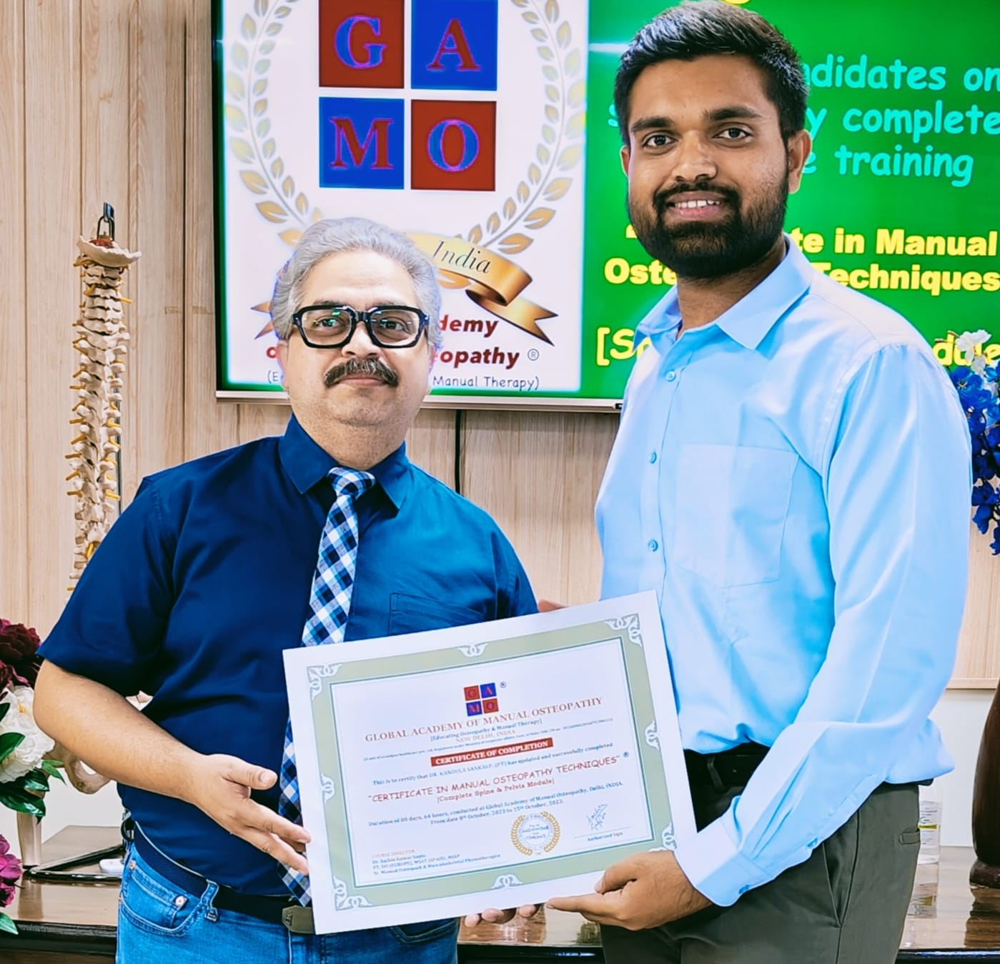

# Feature Implementation Plan: Doctor Biography, New Conditions, and Dry Needling

## Overview
This plan outlines the implementation of three major feature requests:
1. Add Dr. Sankalp's biography to the About page
2. Add new conditions to the Conditions page
3. Add Dry Needling as a separate treatment category

## Current Analysis

### About Page Structure
- Current page has sections: Hero, Our Story, Our Philosophy, Our Approach, Why Choose PhysioPulse, Testimonials, CTA, Contact
- **Best location for doctor biography**: After "Our Story" section, before "Our Philosophy"
- Will create a dedicated "Meet Our Founder" section

### Conditions Page Structure
- Current conditions grid includes: Back Pain, Neck Pain, Shoulder Pain, Knee Pain, Ankle Sprain, Headache, Sports Injuries, Plantar Fasciitis, Hip Pain
- **New conditions to add**:
  - OSTEOARTHRITIS
  - FROZEN SHOULDER
  - Post-surgery rehabilitation
  - Post brain stroke
  - PARKINSON'S
  - CEREBRAL PALSY
  - Acidity
  - Gastro Oesophageal disease (GERD)
  - Constipation
  - Pelvic Misalignment
  - Diabetes management
  - Blood pressure management

### Services Structure
- Current services: Physiotherapy, Chiropractic Care, Exercise Physiology, Home Visit Physiotherapy, Sports Rehabilitation, Workplace Health
- **New service to add**: Dry Needling
- Will create dedicated Dry Needling page with placeholder images

## Implementation Details

### 1. Doctor Biography Section

**Location**: [`src/pages/about.html`](src/pages/about.html) - After "Our Story" section

**Content Structure**:
```html
<section class="doctor-bio-section">
    <div class="container">
        <h2 class="section-title">Meet Dr. Sankalp</h2>
        <div class="doctor-bio-grid">
            <div class="doctor-image">
                
            </div>
            <div class="doctor-content">
                <h3>Founder & Lead Physiotherapist</h3>
                <p><strong>Education:</strong> Nizam's Institute of Medical Sciences, Hyderabad</p>
                <p><strong>Qualifications:</strong> Bachelor of Physiotherapy, Certificate in Osteopathic Techniques (Spine and Pelvis), Certificate in Visceral Manipulation</p>
                <p><strong>Certifications:</strong> Certified Dry Needling Practitioner (U.K.), Fascial Manipulation Therapy (Stecco Institute, Italy), Advanced Training in Visceral Manipulation (Barral Institute, Italy)</p>
                <p><strong>Professional Membership:</strong> International Association of Healthcare Practitioners (IAHP)</p>
                <p><strong>Experience:</strong> 5,000+ patients treated with excellent success rate</p>
            </div>
        </div>
    </div>
</section>
```

### 2. New Conditions Implementation

**A. Update Conditions Index Page** ([`src/pages/conditions/index.html`](src/pages/conditions/index.html))
- Add new conditions to the existing grid structure
- Maintain consistent card design and layout

**B. Create Individual Condition Pages**
- Use [`templates/starter-template.html`](templates/starter-template.html) as base
- Create pages for each new condition:
  - [`src/pages/conditions/osteoarthritis.html`](src/pages/conditions/osteoarthritis.html)
  - [`src/pages/conditions/frozen-shoulder.html`](src/pages/conditions/frozen-shoulder.html)
  - [`src/pages/conditions/post-surgery-rehabilitation.html`](src/pages/conditions/post-surgery-rehabilitation.html)
  - [`src/pages/conditions/post-brain-stroke.html`](src/pages/conditions/post-brain-stroke.html)
  - [`src/pages/conditions/parkinsons.html`](src/pages/conditions/parkinsons.html)
  - [`src/pages/conditions/cerebral-palsy.html`](src/pages/conditions/cerebral-palsy.html)
  - [`src/pages/conditions/acidity.html`](src/pages/conditions/acidity.html)
  - [`src/pages/conditions/gerd.html`](src/pages/conditions/gerd.html)
  - [`src/pages/conditions/constipation.html`](src/pages/conditions/constipation.html)
  - [`src/pages/conditions/pelvic-misalignment.html`](src/pages/conditions/pelvic-misalignment.html)
  - [`src/pages/conditions/diabetes-management.html`](src/pages/conditions/diabetes-management.html)
  - [`src/pages/conditions/blood-pressure-management.html`](src/pages/conditions/blood-pressure-management.html)

### 3. Dry Needling Service Implementation

**A. Create Dry Needling Service Page**
- Location: [`src/pages/services/dry-needling.html`](src/pages/services/dry-needling.html)
- Include placeholder images for treatment demonstration
- Follow existing service page template structure

**B. Update Navigation**
- Add Dry Needling to Services dropdown menu
- Update all navigation headers across the site

**C. Placeholder Images**
- Create placeholder images in [`images/`](images/) directory:
  - `dry-needling-treatment-1.jpg`
  - `dry-needling-treatment-2.jpg`
  - `dry-needling-equipment.jpg`

## Technical Implementation

### CSS Updates
- Add new CSS classes for doctor biography section
- Ensure responsive design for new condition cards
- Maintain design system consistency

### Navigation Updates
- Update Services dropdown in all header navigation files
- Update footer navigation if needed

### SEO Optimization
- Add appropriate meta tags for new pages
- Update [`sitemap.xml`](sitemap.xml) to include new URLs

## File Creation Checklist

### New Files to Create
- [`src/pages/conditions/osteoarthritis.html`](src/pages/conditions/osteoarthritis.html)
- [`src/pages/conditions/frozen-shoulder.html`](src/pages/conditions/frozen-shoulder.html)
- [`src/pages/conditions/post-surgery-rehabilitation.html`](src/pages/conditions/post-surgery-rehabilitation.html)
- [`src/pages/conditions/post-brain-stroke.html`](src/pages/conditions/post-brain-stroke.html)
- [`src/pages/conditions/parkinsons.html`](src/pages/conditions/parkinsons.html)
- [`src/pages/conditions/cerebral-palsy.html`](src/pages/conditions/cerebral-palsy.html)
- [`src/pages/conditions/acidity.html`](src/pages/conditions/acidity.html)
- [`src/pages/conditions/gerd.html`](src/pages/conditions/gerd.html)
- [`src/pages/conditions/constipation.html`](src/pages/conditions/constipation.html)
- [`src/pages/conditions/pelvic-misalignment.html`](src/pages/conditions/pelvic-misalignment.html)
- [`src/pages/conditions/diabetes-management.html`](src/pages/conditions/diabetes-management.html)
- [`src/pages/conditions/blood-pressure-management.html`](src/pages/conditions/blood-pressure-management.html)
- [`src/pages/services/dry-needling.html`](src/pages/services/dry-needling.html)

### Files to Update
- [`src/pages/about.html`](src/pages/about.html) - Add doctor biography section
- [`src/pages/conditions/index.html`](src/pages/conditions/index.html) - Add new conditions to grid
- All header navigation files - Add Dry Needling to Services dropdown
- [`sitemap.xml`](sitemap.xml) - Add new page URLs

## Content Requirements

### Doctor Biography Content
- Full name: Dr. Sankalp
- Education: Nizam's Institute of Medical Sciences, Hyderabad
- Qualifications: Bachelor of Physiotherapy
- Certifications: Osteopathic Techniques, Visceral Manipulation, Dry Needling Practitioner (U.K.), Fascial Manipulation Therapy (Stecco Institute, Italy), Visceral Manipulation (Barral Institute, Italy)
- Professional Membership: International Association of Healthcare Practitioners (IAHP)
- Experience: 5,000+ patients treated
- Philosophy: Cutting-edge manual therapy treating root causes

### Dry Needling Content
- Description of treatment technique
- Benefits and applications
- Safety information
- Patient testimonials (if available)
- Before/after examples

## Testing Checklist
- [ ] All new pages load correctly
- [ ] Navigation links work properly
- [ ] Images display correctly
- [ ] Mobile responsiveness maintained
- [ ] SEO meta tags are present
- [ ] All internal links work
- [ ] Cross-browser compatibility

## Timeline
This implementation can be completed in a single development session. The work involves:
- Content creation and formatting
- HTML structure implementation
- CSS styling updates
- Navigation integration
- Testing and validation

## Success Metrics
- Doctor biography prominently displayed on About page
- All new conditions accessible via Conditions page
- Dry Needling service page fully functional
- Consistent user experience across all pages
- SEO-friendly structure maintained